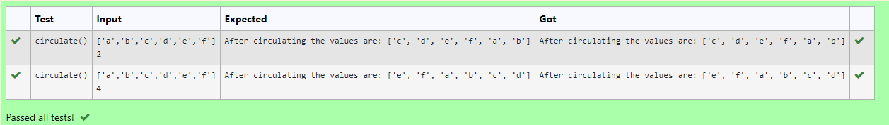

# Circulate-the-values-of-N-variables
## Aim:
To write a python program to circulate the n variables using function concept
## Equipment’s required:
PC
Anaconda - Python 3.7
## Algorithm: 
### Step 1:
Get the value form the user for rotation.

### Step 2:
Get the value from the user for the number of rotation

### Step 3:
Using the slicing concept rotate the lis 
## Program:
```
#Program to circulate N values.
#Developed by:Berjin Shabeck.H
#RegisterNumber:22007550
def circulate():
    n=eval(input())
    a=int(input())
    m=n[a:]+n[:a]
    print("After circulating the values are:",m)
```

## Output:


## Result:
Thus the program is developed for circulate the n variables.
